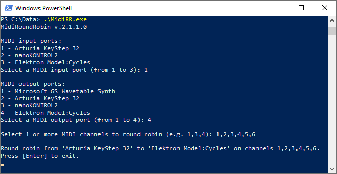

MidiRoundRobin
==============
MidiRoundRobin is a command line utility that performs a round robin between MIDI channels.



## How it works
Suppose you play some notes on a MIDI keyboard, let's say C, D, E, F on channel 1; here's what happens:

**[MIDI keyboard]** -> C (ch **1**), D (ch **1**), E (ch **1**), F (ch **1**) -> **[MidiRoundRobin utility]** -> C (ch **1**), D (ch **2**), E (ch **3**), F (ch **1**)

As you can see, output channels are rotated (round robin). The output channels sequence can be configurated (see below).

This is useful if you want to "spread" your notes between different MIDI channels, for example if you have three monophonic synths and you want to play polyphonic melodies.

I created this application to play with Elektron Model:Cycles, a monophonic, six tracks synth; all you have to do is:

- set the same instrument on all six tracks of the Moidel:Cycles
- connect the Model:Cycles via MIDI to the PC
- launch MidiRoundRobin (MidiRR.exe) and, when asked:
	- select your keyboard as MIDI in, and the Model:Cycles as MIDI out
	- select the channels 1,2,3,4,5,6 as MIDI output to feed all the tracks
- play your six notes chords!

You can also set only one output channel, for a simple MIDI routing without a full blown DAW.

## Configuration
There are 3 ways to configure MidiRoundRobin:

### 1. interactive mode
The default, active if methods 2 and 3 are not used; you are asked for MIDI in/out ports and channels - see the screenshot above.

### 2. configuration file
You can create a json file named **MidiRR.settings.json** to store the settings. Put it on the same folder as the executable.  
Here's an example:
```json
// MidiRR.settings.json
{
  "midiIn": "Arturia KeyStep 32",
  "midiOut": "Elektron Model:Cycles",
  "channels": "1,2,3,4,5,6"
}
```

### 3. command line arguments
Overrides the configuration file:
```
> MidiRR.exe --midiIn="Arturia KeyStep 32" --midiOut="Elektron Model:Cycles" --channels="1,2,3,4,5,6"
```

You can mix 1, 2 and 3 (some settings passed by argument, some in MidiRR.settings.json and the rest entered in interactive mode).

## Limitations
The following MIDI messages are supported: **note on/off**, **pitch bend**, **channel aftertouch**, **control change**, **program change**, **clock**.  
Other messages types are discarded.

MidiRoundRobin can be used together with a DAW (e.g. Ableton Live), but the chosen in and out MIDI ports will not be available to the DAW.

## Environment and supported platforms
* .NET Core 3
* managed-midi package dependency
* tested on Windows 10 and Linux - some timing issues on Ubuntu

## Todo
- ~~handle configuration files~~
- (!) investigate on Linux timing issues
- test on Mac - any volunteer? Just drop me a few lines

## License
GNU GENERAL PUBLIC LICENSE V 3

---

Copyright (C) [Massimo Barbieri](http://www.massimobarbieri.it) 
